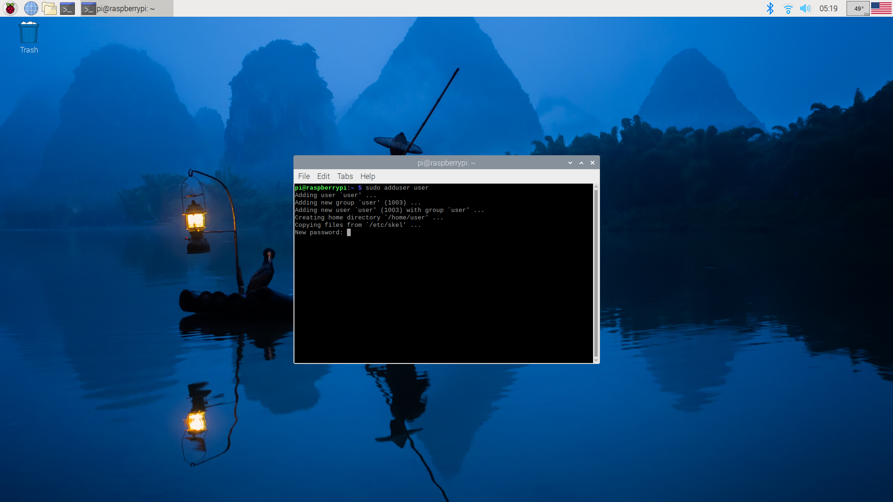
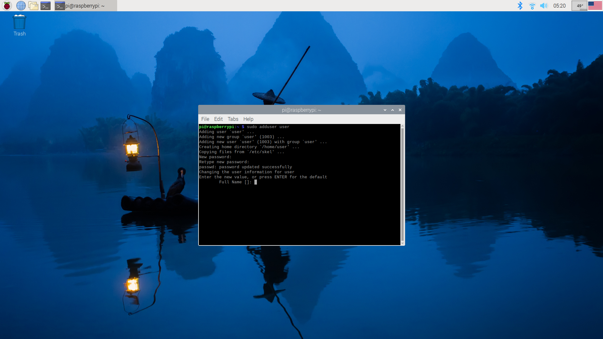
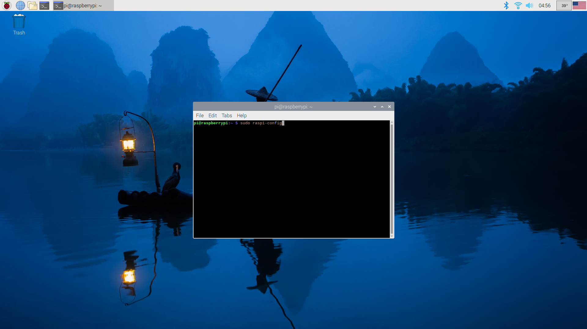
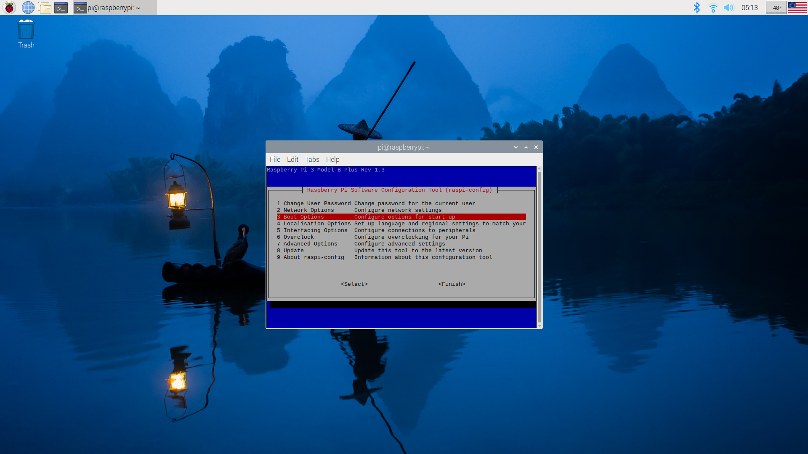
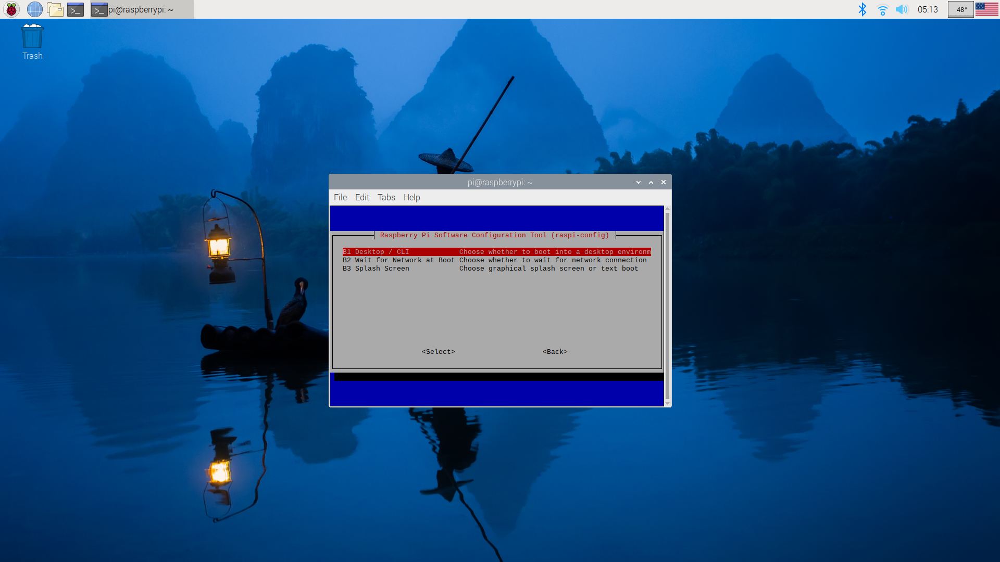
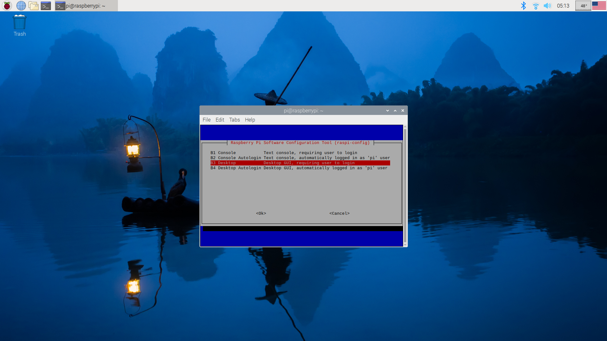
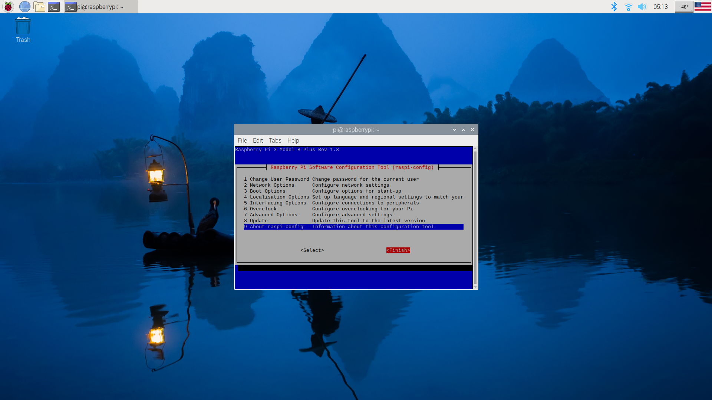

# Add a new user on raspberry pi

```sudo adduser username ``` will create a user with the name username
Type ``` Ctrl + alt + T ```  to open the terminal, then to create a user with name "user" type ```sudo adduser user```


After ``` new password``` type the password for user and type ``` Enter ```. Then after ```Retype new password``` type the password again. You cannot see the password even if you type it. 


Then type ```Enter``` until you see the line ``` Is this information correct? [Y/n] ```. After that line type ```y``` and then ``` Enter ```.


Type ``` cd /home && ls```. If you see ```username```, you successfully created the user.

## Enable login page
Now we will enable a login page for raspberry pi.
Type ```raspi-config``` in the terminal.

Use the down key to go to ```3  Boot Options ``` and type ```Enter```. Follow the other instructions.



When you finish, use the down arrow to scroll down, then use the right arrow key to select ```Finish.``` Type ```Enter``` to finish.

