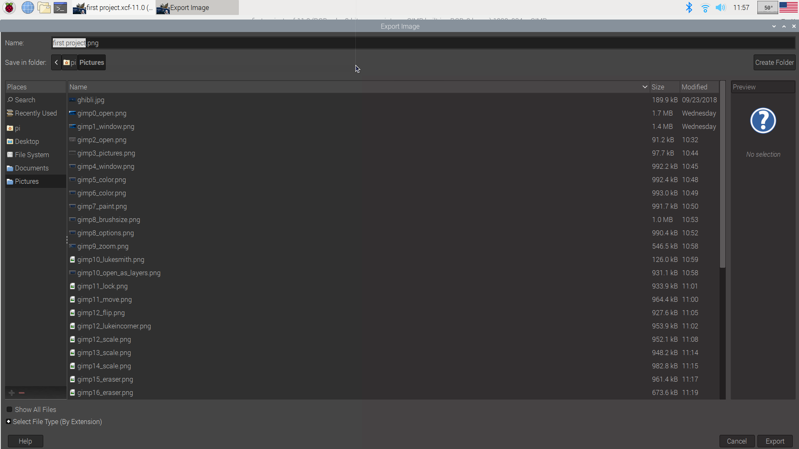
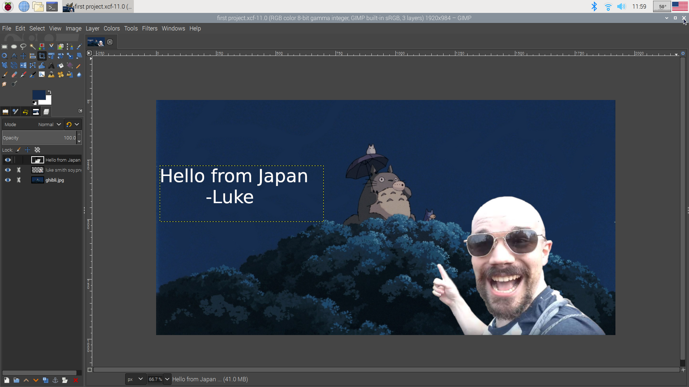

# GIMP

## Keyboard shortcuts guide:


#### File
``` Ctrl + O ``` : Open

``` Ctrl + N ``` : New

``` Ctrl + Alt + O ``` : Open as layer go ``` Graphics ```, and select ```Gnu Image Manipulation Program```

#### Toolbox
``` O ``` : Color picker

## Opening and editing an image in GIMP

To open GIMP, click on the raspberry button in the top left corner,


Open the document by going to the top menu and clicking on file.






